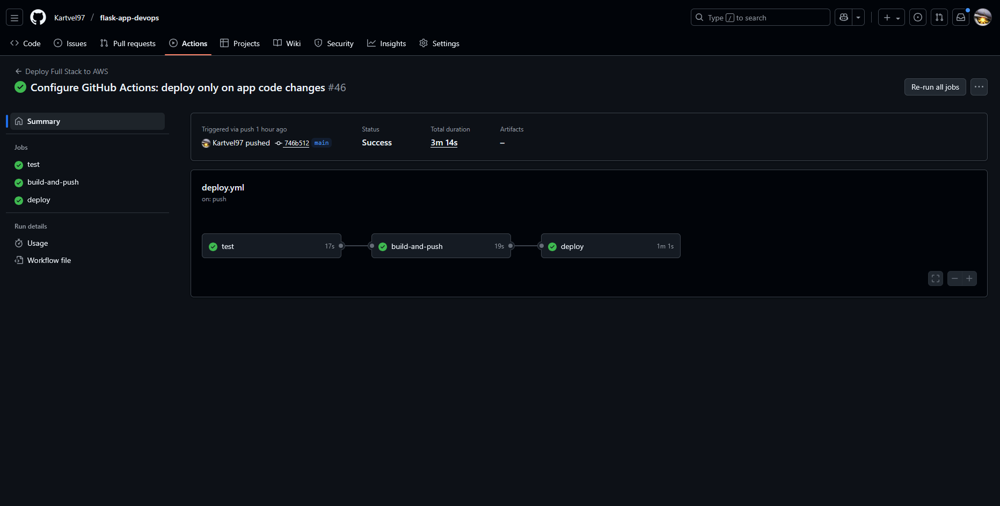
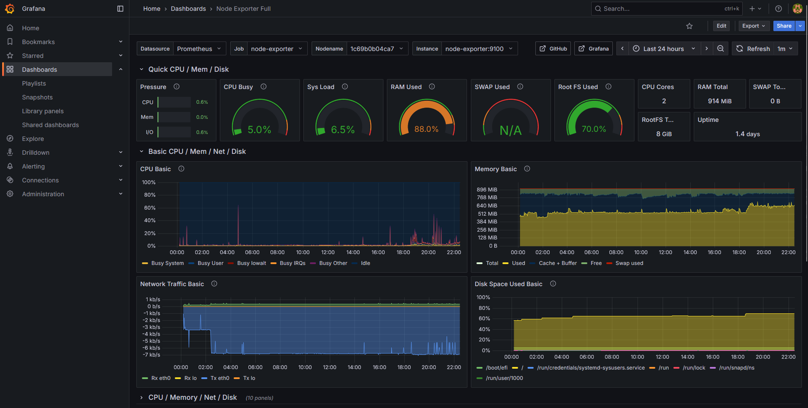
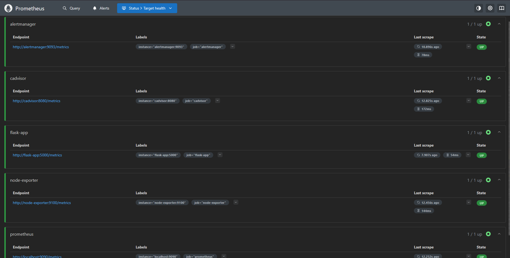

# 🚀 Flask DevOps Project

<div align="center">

**Production-ready Flask application deployed with modern DevOps practices**

[](https://www.python.org/)
[](https://flask.palletsprojects.com/)
[](https://www.docker.com/)
[](https://www.terraform.io/)
[](https://www.ansible.com/)
[](https://github.com/features/actions)

[🌐 Live Demo](https://flask.mervel.pp.ua) • [📖 Documentation](#-documentation) • [🛠️ Setup](#-quick-start)

</div>

---

## 📋 About This Project

> **Note:** This is a **learning project** created to demonstrate understanding of DevOps practices.  
> I'm a **beginner DevOps engineer** (Trainee/Junior level) who is learning modern practices and tools.
> 
> **AI Tools Used:** During development, I used modern AI assistants (**ChatGPT**, **Phind**, **GitHub Copilot**) for research, validation, and optimization of configurations according to DevOps best practices. These tools helped me understand concepts, fix errors, and learn industry standards.
> 
> Many parts of this project were learned from official documentation, tutorials, and best practices guides.  
> This project helped me understand how different DevOps tools work together in a real-world scenario.

This project demonstrates a complete DevOps lifecycle for a Flask web application — from infrastructure provisioning to automated deployment, monitoring, and backup strategies.

**What I learned (mostly from documentation and tutorials):**
- ✅ Infrastructure as Code with Terraform (learned from HashiCorp documentation)
- ✅ Configuration Management with Ansible (learned from Ansible documentation)
- ✅ CI/CD pipelines with GitHub Actions (learned from GitHub Actions documentation)
- ✅ Containerization with Docker (learned from Docker documentation)
- ✅ Monitoring and Observability (Prometheus, Grafana, Loki - learned from their official docs)
- ✅ Automated backup and recovery (learned from AWS S3 documentation)
- ✅ Security best practices (learned from AWS security guides)

---

## 🌐 Live Demo

🔗 **Application:** [https://flask.mervel.pp.ua](https://flask.mervel.pp.ua)  
_Deployed on AWS EC2 using Terraform, Ansible, Docker, Nginx, and Cloudflare SSL._

---

## 🏗️ Architecture

```
┌─────────────────────────────────────────────────────────────┐
│                    Cloudflare (CDN/DNS/SSL)                  │
└───────────────────────────┬─────────────────────────────────┘
                            │
┌───────────────────────────▼─────────────────────────────────┐
│              AWS EC2 (t3.micro, Ubuntu 22.04)                │
│  ┌──────────────────────────────────────────────────────┐   │
│  │              Nginx (Reverse Proxy + SSL)              │   │
│  └───────────────────────────┬──────────────────────────┘   │
│                              │                               │
│  ┌───────────────────────────▼──────────────────────────┐   │
│  │         Docker Network (monitoring)                    │   │
│  │  ┌──────────────┐  ┌──────────────┐  ┌────────────┐ │   │
│  │  │ Flask App    │  │ Prometheus   │  │  Grafana   │ │   │
│  │  │ (Gunicorn)   │  │ (Metrics)    │  │ (Dashboards)│ │   │
│  │  └──────────────┘  └──────────────┘  └────────────┘ │   │
│  │  ┌──────────────┐  ┌──────────────┐  ┌────────────┐ │   │
│  │  │    Loki      │  │  Promtail    │  │Node Exporter│ │   │
│  │  │   (Logs)     │  │ (Log Agent)  │  │ (Metrics)  │ │   │
│  │  └──────────────┘  └──────────────┘  └────────────┘ │   │
│  │  ┌──────────────┐  ┌──────────────┐                  │   │
│  │  │Alertmanager  │  │  cAdvisor    │                  │   │
│  │  │  (Alerts)    │  │ (Containers) │                  │   │
│  │  └──────────────┘  └──────────────┘                  │   │
│  └──────────────────────────────────────────────────────┘   │
└─────────────────────────────────────────────────────────────┘
```

### CI/CD Pipeline

```
┌─────────────┐
│ GitHub Push │
└──────┬──────┘
       │
       ▼
┌─────────────────┐
│  GitHub Actions │
│  ┌───────────┐  │
│  │   Test    │  │ ← pytest
│  └─────┬─────┘  │
│        │        │
│  ┌─────▼─────┐  │
│  │   Build   │  │ ← Docker
│  └─────┬─────┘  │
│        │        │
│  ┌─────▼─────┐  │
│  │   Push    │  │ ← GHCR
│  └─────┬─────┘  │
│        │        │
│  ┌─────▼─────┐  │
│  │  Deploy   │  │ ← SSH → AWS
│  └───────────┘  │
└─────────────────┘
```

---

## 🛠️ Tech Stack

| Layer | Technology | Purpose |
|-------|------------|---------|
| **CDN/DNS** | Cloudflare | Global CDN, DDoS protection, SSL |
| **Cloud** | AWS EC2 | Compute instance (t3.micro) |
| **OS** | Ubuntu 22.04 LTS | Server environment |
| **Web Server** | Nginx | Reverse proxy + SSL termination |
| **Container** | Docker | Application isolation |
| **App Server** | Gunicorn | WSGI HTTP server |
| **Framework** | Flask | Web framework |
| **Language** | Python 3.11+ | Backend language |
| **IaC** | Terraform | Infrastructure provisioning |
| **Config Mgmt** | Ansible | Server automation |
| **CI/CD** | GitHub Actions | Automated deployment |
| **Monitoring** | Prometheus | Metrics collection |
| **Visualization** | Grafana | Dashboards |
| **Logging** | Loki + Promtail | Centralized logging |
| **Alerts** | Alertmanager | Alert management |
| **Backup** | Scripts + S3 | Automated backups |

---

## 📁 Project Structure

```
flask-app-devops/
├── .github/
│   └── workflows/
│       └── deploy.yml          # CI/CD pipeline
├── ansible/                    # Configuration Management
│   ├── deploy-flask-app.yml
│   ├── setup-monitoring.yml
│   ├── setup-nginx-ssl.yml
│   ├── setup-backup.yml
│   └── inventory.ini.example
├── backup/                     # Backup & Recovery
│   ├── scripts/
│   │   ├── backup.sh
│   │   ├── restore.sh
│   │   └── verify_backup.sh
│   └── config/
├── docker/                     # Docker Configuration
│   ├── Dockerfile
│   ├── docker-compose.app.yml
│   └── requirements.txt
├── monitoring/                 # Monitoring Stack
│   ├── docker-compose.monitoring.yml
│   ├── prometheus/
│   │   ├── prometheus.yml
│   │   ├── alerts.yml
│   │   └── alertmanager.yml
│   ├── grafana/
│   │   ├── dashboards/
│   │   │   └── flask-app-dashboard.json
│   │   ├── import-dashboards.sh
│   │   ├── setup-alerts.sh
│   │   └── provisioning/
│   ├── loki/
│   │   └── loki-config.yml
│   └── promtail/
│       └── promtail-config.yml
├── src/                        # Application Code
│   └── app.py
├── tests/                      # Tests
│   ├── test_app.py
│   └── requirements.txt
├── terraform/                  # Infrastructure as Code
│   └── main.tf
├── README.md
└── SETUP_REQUIREMENTS.md
```

---

## 🚀 Quick Start

### Prerequisites

- AWS Account with credentials configured
- SSH key pair in AWS
- Domain name (optional, for SSL)
- GitHub repository with Actions enabled

### 1️⃣ Deploy Infrastructure

```bash
cd terraform
terraform init
terraform plan -var="ssh_key_name=your_key_name"
terraform apply -var="ssh_key_name=your_key_name"
```

**Output:**
```
public_ip = "YOUR_EC2_PUBLIC_IP"
```

### 2️⃣ Configure Ansible

```bash
cp ansible/inventory.ini.example ansible/inventory.ini
# Edit ansible/inventory.ini with your IP and SSH key path
```

### 3️⃣ Deploy Application

```bash
cd ansible
ansible-playbook -i inventory.ini deploy-flask-app.yml
```

### 4️⃣ Setup Nginx + SSL

```bash
ansible-playbook -i inventory.ini setup-nginx-ssl.yml \
  -e "domain_name=your-domain.com" \
  -e "email=your@email.com"
```

### 5️⃣ Setup Monitoring

```bash
ansible-playbook -i inventory.ini setup-monitoring.yml
```

### 6️⃣ Setup Backups

```bash
ansible-playbook -i inventory.ini setup-backup.yml
```

---

## 📊 Monitoring & Observability

### 📈 Prometheus

**Access:** `http://YOUR_SERVER_IP:9090`

Prometheus collects metrics from:
- Flask application (custom metrics)
- Node Exporter (system metrics)
- cAdvisor (container metrics)
- Loki (log aggregation metrics)
- Promtail (log collection metrics)

**Key Metrics:**
- HTTP request rate and latency
- Error rates (4xx, 5xx)
- CPU and memory usage
- Container resource usage

### 📊 Grafana

**Access:** `http://YOUR_SERVER_IP:3000`

**Pre-configured Dashboards (automatically imported on deployment):**
- Flask Application Metrics - Custom dashboard with HTTP request statistics, latency, error rates, CPU and memory usage
- Loki Logs - Pre-built dashboard from Grafana Labs (ID: 12611)
- Prometheus - Pre-built dashboard from Grafana Labs (ID: 1860)
- Alerts - Pre-built dashboard from Grafana Labs (ID: 3489)
- Docker Container & Host Metrics - Pre-built dashboard from Grafana Labs (ID: 179)

All dashboards are automatically imported and configured during deployment.


### 📝 Loki (Logging)

**Access:** `http://YOUR_SERVER_IP:3100`

Loki collects structured JSON logs from:
- Flask application
- All Docker containers
- System logs

**LogQL Queries:**
```logql
# All Flask logs
{container="flask-app"}

# Error logs only
{container="flask-app"} |= "error"

# Logs with specific status code
{container="flask-app"} | json | status_code=~"5.."
```

### 🚨 Alerting

**Alertmanager:** `http://YOUR_SERVER_IP:9093`

**Grafana Alerts (automatically configured on deployment):**
- 🔴 **Critical:**
  - Flask application down - Triggers when `up{job="flask-app"} == 0` for 1 minute
  - Low disk space - Triggers when disk space < 10% for 5 minutes

- 🟡 **Warning:**
  - High CPU usage - Triggers when CPU > 80% for 5 minutes
  - High error rate - Triggers when 5xx error rate > 0.1 req/sec for 5 minutes

All Grafana alert rules are automatically created via API during deployment.

**Prometheus Alerts:**
- Alert rules: `monitoring/prometheus/alerts.yml`
- Alertmanager config: `monitoring/prometheus/alertmanager.yml`

---

## 💾 Backup & Recovery

### Automated Backups

**Schedule:** Daily at 02:00 UTC (via systemd timer)

**What's Backed Up:**
- Docker volumes (Prometheus, Grafana, Loki data)
- Application code
- Configuration files
- Monitoring configurations

**Retention:**
- Local: 7 days
- S3: 30 days (if configured)

### Manual Backup

```bash
# On the server
sudo /usr/local/bin/backup.sh
```

### Restore

```bash
# List available backups
ls -lh /opt/backups/

# Restore from backup
sudo /usr/local/bin/restore.sh /opt/backups/backup_YYYYMMDD_HHMMSS.tar.gz
```

### S3 Integration

Backups are automatically uploaded to S3 if:
- AWS CLI is installed
- S3 bucket is configured (via Terraform)
- IAM role is attached to EC2 instance

**Check S3 Backups:**
```bash
aws s3 ls s3://flask-app-backups-XXXXXXXX/backups/
```

---

## 🔒 Security Features

- ✅ **Rate Limiting** - Nginx rate limiting (10 req/s for API, 30 req/s general)
- ✅ **SSL/TLS** - Let's Encrypt certificates with auto-renewal
- ✅ **Security Headers** - X-Frame-Options, HSTS, XSS Protection
- ✅ **Structured Logging** - JSON logs for security auditing
- ✅ **Error Handling** - Proper error responses without exposing internals
- ✅ **Non-root User** - Docker containers run as non-root

---

## 🧪 Testing

**Run Tests:**
```bash
pytest tests/ -v --cov=src --cov-report=term-missing
```

**Test Coverage:**
- Health check endpoints
- System info endpoints
- Metrics endpoints
- Error handling
- API endpoints

**CI/CD Integration:**
Tests run automatically on every push via GitHub Actions.

---


### GitHub Actions CI/CD Workflow

_Successful deployment via GitHub Actions: Test → Build & Push → Deploy_

### Grafana Dashboard

_Monitoring dashboards for metrics and logs_

### Prometheus Targets

_Status of all targets for metrics collection_

---

## 🔧 CI/CD Pipeline

### Automated Deployment

The pipeline runs automatically on push to `main` branch (only for code changes, not documentation).

**Pipeline Stages:**

1. **Test** - Run pytest with coverage
2. **Build** - Build Docker image
3. **Push** - Push to GitHub Container Registry
4. **Deploy** - Deploy to AWS via SSH

**Manual Trigger:**
You can also trigger deployment manually via GitHub Actions UI.


---

## 📚 Documentation

- [SETUP_REQUIREMENTS.md](SETUP_REQUIREMENTS.md) - Complete setup guide

---

## 🎓 Learning Outcomes

As a beginner DevOps engineer, this project helped me understand:

### Infrastructure as Code
- ✅ Terraform for AWS resource provisioning
- ✅ Managing infrastructure state
- ✅ Outputs and variables

### Configuration Management
- ✅ Ansible playbooks for server configuration
- ✅ Idempotent operations
- ✅ Role-based organization

### CI/CD
- ✅ GitHub Actions workflows
- ✅ Automated testing
- ✅ Docker image building and pushing
- ✅ Automated deployment

### Containerization
- ✅ Docker and Docker Compose
- ✅ Multi-stage builds
- ✅ Container networking
- ✅ Health checks

### Monitoring & Observability
- ✅ Prometheus metrics collection
- ✅ Grafana dashboards
- ✅ Centralized logging with Loki
- ✅ Alerting with Alertmanager

### Backup & Recovery
- ✅ Automated backup scripts
- ✅ S3 integration
- ✅ Recovery procedures
- ✅ Systemd timers

### Security
- ✅ Rate limiting
- ✅ SSL/TLS
- ✅ Security headers
- ✅ Secrets management

---

## 🛣️ Roadmap

Future improvements I'd like to implement:

- [ ] Multi-environment support (dev/staging/prod)
- [ ] Blue-green deployment strategy
- [ ] Performance testing (load testing)
- [ ] Secrets management (AWS Secrets Manager)
- [ ] Multi-AZ deployment for high availability
---

## 🤝 Contributing

This is a learning project, but suggestions and feedback are welcome!

If you find any issues or have suggestions:
1. Open an issue
2. Fork the repository
3. Create a pull request

---

## 📝 License

This project is open source and available under the [MIT License](LICENSE).

---

## 👨‍💻 Author

**Kartvel97**

- 🌐 GitHub: [@Kartvel97](https://github.com/Kartvel97)
- 💼 LinkedIn: [linkedin.com/in/kartvel97](https://www.linkedin.com/in/kartvel97)
- 📧 Email: barem068@gmail.com

---

## 💬 About This Project

> This project was developed as part of my DevOps learning journey.  
> I'm a **beginner DevOps engineer** (Trainee/Junior level) who is learning modern practices and tools.
> 
> **AI Tools Used:** During development, I used modern AI assistants (**ChatGPT**, **Phind**, **GitHub Copilot**) for research, validation, and optimization of configurations according to DevOps best practices. These tools helped me understand concepts, fix errors, and learn industry standards.
> 
> Many parts of this project were learned from official documentation, tutorials, and best practices guides.  
> This project helped me understand how different DevOps tools work together in a real-world scenario.
>
> **My goal:** Demonstrate understanding of DevOps fundamentals while being transparent about my learning process. I want to show that I understand the concepts, even if I'm still learning the details.

---

<div align="center">

**Made with ❤️ by a beginner DevOps engineer**

⭐ Star this repo if you found it helpful!

</div>

---

---

# 🇺🇦 Flask DevOps Проєкт (Українською)

<div align="center">

**Production-ready Flask застосунок з сучасними DevOps практиками**

[](https://www.python.org/)
[](https://flask.palletsprojects.com/)
[](https://www.docker.com/)
[](https://www.terraform.io/)
[](https://www.ansible.com/)

[🌐 Демо](https://flask.mervel.pp.ua) • [📖 Документація](#-документація) • [🛠️ Швидкий старт](#-швидкий-старт)

</div>

---

## 📋 Про цей проєкт

> **Примітка:** Це **навчальний проєкт**, створений для демонстрації розуміння DevOps практик.  
> Я **початківець DevOps інженер** (Trainee/Junior рівень), який вивчає сучасні практики та інструменти.
> **Використані ІІ інструменти:** Під час розробки я використовував сучасні ІІ асистенти (**ChatGPT**, **Phind**, **GitHub Copilot**) для дослідження, валідації та 
оптимізації конфігурацій відповідно до DevOps best practices. Ці інструменти допомогли мені зрозуміти концепції, виправити помилки та вивчити стандарти індустрії.
> Багато частин цього проєкту були вивчені з офіційної документації, туторіалів та гайдів з best practices.  
> Цей проєкт допоміг мені зрозуміти як різні DevOps інструменти працюють разом у реальному сценарії.

Цей проєкт демонструє повний DevOps цикл для Flask веб-застосунку — від створення інфраструктури до автоматизованого деплою, моніторингу та стратегій резервного копіювання.

**Що я вивчив (переважно з документації та туторіалів):**
- ✅ Infrastructure as Code з Terraform (вивчив з документації HashiCorp)
- ✅ Configuration Management з Ansible (вивчив з документації Ansible)
- ✅ CI/CD пайплайни з GitHub Actions (вивчив з документації GitHub Actions)
- ✅ Контейнеризація з Docker (вивчив з документації Docker)
- ✅ Моніторинг та Observability (Prometheus, Grafana, Loki - вивчив з їх офіційної документації)
- ✅ Автоматичне резервне копіювання та відновлення (вивчив з документації AWS S3)
- ✅ Практики безпеки (вивчив з гайдів AWS security)

---

## 🌐 Демо

🔗 **Застосунок:** [https://flask.mervel.pp.ua](https://flask.mervel.pp.ua)  
_Розгорнуто на AWS EC2 з використанням Terraform, Ansible, Docker, Nginx та Cloudflare SSL._

---

## 🏗️ Архітектура

```
┌─────────────────────────────────────────────────────────────┐
│              Cloudflare (CDN/DNS/SSL)                        │
└───────────────────────────┬─────────────────────────────────┘
                            │
┌───────────────────────────▼─────────────────────────────────┐
│          AWS EC2 (t3.micro, Ubuntu 22.04)                    │
│  ┌──────────────────────────────────────────────────────┐   │
│  │         Nginx (Reverse Proxy + SSL)                   │   │
│  └───────────────────────────┬──────────────────────────┘   │
│                              │                               │
│  ┌───────────────────────────▼──────────────────────────┐   │
│  │      Docker Network (monitoring)                      │   │
│  │  ┌──────────────┐  ┌──────────────┐  ┌────────────┐ │   │
│  │  │ Flask App    │  │ Prometheus   │  │  Grafana   │ │   │
│  │  │ (Gunicorn)   │  │ (Метрики)    │  │ (Дашборди) │ │   │
│  │  └──────────────┘  └──────────────┘  └────────────┘ │   │
│  │  ┌──────────────┐  ┌──────────────┐  ┌────────────┐ │   │
│  │  │    Loki      │  │  Promtail    │  │Node Exporter│ │   │
│  │  │   (Логи)     │  │ (Збір логів) │  │ (Метрики)  │ │   │
│  │  └──────────────┘  └──────────────┘  └────────────┘ │   │
│  │  ┌──────────────┐  ┌──────────────┐                  │   │
│  │  │Alertmanager  │  │  cAdvisor    │                  │   │
│  │  │  (Алерти)    │  │ (Контейнери) │                  │   │
│  │  └──────────────┘  └──────────────┘                  │   │
│  └──────────────────────────────────────────────────────┘   │
└─────────────────────────────────────────────────────────────┘
```

---

## 🛠️ Технологічний стек

| Рівень | Технологія | Призначення |
|--------|------------|-------------|
| **CDN/DNS** | Cloudflare | Глобальний CDN, захист від DDoS, SSL |
| **Хмара** | AWS EC2 | Обчислювальний інстанс (t3.micro) |
| **ОС** | Ubuntu 22.04 LTS | Серверне середовище |
| **Веб-сервер** | Nginx | Reverse proxy + SSL termination |
| **Контейнер** | Docker | Ізоляція застосунку |
| **Сервер застосунку** | Gunicorn | WSGI HTTP сервер |
| **Фреймворк** | Flask | Веб-фреймворк |
| **Мова** | Python 3.11+ | Мова програмування |
| **IaC** | Terraform | Створення інфраструктури |
| **Config Mgmt** | Ansible | Автоматизація серверів |
| **CI/CD** | GitHub Actions | Автоматизований деплой |
| **Моніторинг** | Prometheus | Збір метрик |
| **Візуалізація** | Grafana | Дашборди |
| **Логування** | Loki + Promtail | Централізоване логування |
| **Алерти** | Alertmanager | Управління алертами |
| **Бекапи** | Скрипти + S3 | Автоматичні бекапи |

---

## 🚀 Швидкий старт

### Передумови

- AWS аккаунт з налаштованими credentials
- SSH ключова пара в AWS
- Доменне ім'я (опціонально, для SSL)
- GitHub репозиторій з увімкненими Actions

### 1️⃣ Розгортання інфраструктури

```bash
cd terraform
terraform init
terraform plan -var="ssh_key_name=your_key_name"
terraform apply -var="ssh_key_name=your_key_name"
```

**Вивід:**
```
public_ip = "YOUR_EC2_PUBLIC_IP"
```

### 2️⃣ Налаштування Ansible

```bash
cp ansible/inventory.ini.example ansible/inventory.ini
# Відредагуйте ansible/inventory.ini з вашим IP та шляхом до SSH ключа
```

### 3️⃣ Деплой застосунку

```bash
cd ansible
ansible-playbook -i inventory.ini deploy-flask-app.yml
```

### 4️⃣ Налаштування Nginx + SSL

```bash
ansible-playbook -i inventory.ini setup-nginx-ssl.yml \
  -e "domain_name=your-domain.com" \
  -e "email=your@email.com"
```

### 5️⃣ Налаштування моніторингу

```bash
ansible-playbook -i inventory.ini setup-monitoring.yml
```

### 6️⃣ Налаштування бекапів

```bash
ansible-playbook -i inventory.ini setup-backup.yml
```

---

## 📊 Моніторинг та Observability

### 📈 Prometheus

**Доступ:** `http://YOUR_SERVER_IP:9090`

Prometheus збирає метрики з:
- Flask застосунку (кастомні метрики)
- Node Exporter (системні метрики)
- cAdvisor (метрики контейнерів)
- Loki (метрики агрегації логів)
- Promtail (метрики збору логів)

**Ключові метрики:**
- Швидкість та затримка HTTP запитів
- Частота помилок (4xx, 5xx)
- Використання CPU та пам'яті
- Використання ресурсів контейнерів

### 📊 Grafana

**Доступ:** `http://YOUR_SERVER_IP:3000`

**Попередньо налаштовані дашборди (автоматично імпортуються при деплої):**
- Метрики Flask застосунку - Кастомний дашборд зі статистикою HTTP запитів, затримкою, частотою помилок, використанням CPU та пам'яті
- Loki Logs - Готовий дашборд з Grafana Labs (ID: 12611)
- Prometheus - Готовий дашборд з Grafana Labs (ID: 1860)
- Alerts - Готовий дашборд з Grafana Labs (ID: 3489)
- Docker Container & Host Metrics - Готовий дашборд з Grafana Labs (ID: 179)

Всі дашборди автоматично імпортуються та налаштовуються під час деплою.

### 📝 Loki (Логування)

**Доступ:** `http://YOUR_SERVER_IP:3100`

Loki збирає структуровані JSON логи з:
- Flask застосунку
- Всіх Docker контейнерів
- Системних логів

**LogQL запити:**
```logql
# Всі логи Flask
{container="flask-app"}

# Тільки логи з помилками
{container="flask-app"} |= "error"

# Логи з певним статус кодом
{container="flask-app"} | json | status_code=~"5.."
```

### 🚨 Алертинг

**Alertmanager:** `http://YOUR_SERVER_IP:9093`

**Grafana алерти (автоматично налаштовуються при деплої):**
- 🔴 **Критичні:**
  - Flask застосунок недоступний - Спрацьовує коли `up{job="flask-app"} == 0` протягом 1 хвилини
  - Мало місця на диску - Спрацьовує коли вільне місце < 10% протягом 5 хвилин

- 🟡 **Попередження:**
  - Високе використання CPU - Спрацьовує коли CPU > 80% протягом 5 хвилин
  - Висока частота помилок - Спрацьовує коли частота помилок 5xx > 0.1 req/sec протягом 5 хвилин

Всі правила алертів Grafana автоматично створюються через API під час деплою.

**Prometheus алерти:**
- Правила алертів: `monitoring/prometheus/alerts.yml`
- Конфігурація Alertmanager: `monitoring/prometheus/alertmanager.yml`

---

## 💾 Резервне копіювання та відновлення

### Автоматичні бекапи

**Розклад:** Щодня о 02:00 UTC (через systemd timer)

**Що бекапиться:**
- Docker volumes (дані Prometheus, Grafana, Loki)
- Код застосунку
- Файли конфігурації
- Конфігурації моніторингу

**Зберігання:**
- Локально: 7 днів
- S3: 30 днів (якщо налаштовано)

### Ручне резервне копіювання

```bash
# На сервері
sudo /usr/local/bin/backup.sh
```

### Відновлення

```bash
# Список доступних бекапів
ls -lh /opt/backups/

# Відновлення з бекапу
sudo /usr/local/bin/restore.sh /opt/backups/backup_YYYYMMDD_HHMMSS.tar.gz
```

### S3 інтеграція

Бекапи автоматично завантажуються в S3, якщо:
- AWS CLI встановлено
- S3 bucket налаштовано (через Terraform)
- IAM роль прикріплено до EC2 інстансу

---

## 🔒 Функції безпеки

- ✅ **Rate Limiting** - Обмеження швидкості в Nginx (10 req/s для API, 30 req/s загальне)
- ✅ **SSL/TLS** - Сертифікати Let's Encrypt з автоматичним оновленням
- ✅ **Security Headers** - X-Frame-Options, HSTS, XSS Protection
- ✅ **Структуроване логування** - JSON логи для аудиту безпеки
- ✅ **Обробка помилок** - Правильні відповіді без розкриття внутрішньої інформації
- ✅ **Non-root User** - Docker контейнери запускаються не від root

---

## 🧪 Тестування

**Запуск тестів:**
```bash
pytest tests/ -v --cov=src --cov-report=term-missing
```

**Покриття тестами:**
- Health check endpoints
- System info endpoints
- Metrics endpoints
- Обробка помилок
- API endpoints

**Інтеграція CI/CD:**
Тести запускаються автоматично при кожному push через GitHub Actions.

---

### GitHub Actions CI/CD Workflow

_Успішний деплой через GitHub Actions: Test → Build & Push → Deploy_

### Grafana Dashboard

_Дашборди моніторингу метрик та логів_

### Prometheus Targets

_Статус всіх targets для збору метрик_

---

## 🔧 CI/CD Pipeline

### Автоматичний деплой

Пайплайн запускається автоматично при push в `main` гілку (тільки для змін коду, не документації).

**Етапи пайплайну:**

1. **Test** - Запуск pytest з покриттям
2. **Build** - Збірка Docker образу
3. **Push** - Завантаження в GitHub Container Registry
4. **Deploy** - Деплой на AWS через SSH

**Ручний запуск:**
Також можна запустити деплой вручну через GitHub Actions UI.

---

## 📚 Документація

- [SETUP_REQUIREMENTS.md](SETUP_REQUIREMENTS.md) - Повний гайд з налаштування

---

## 🎓 Результати навчання

Як початківець DevOps інженер, цей проєкт допоміг мені зрозуміти:

### Infrastructure as Code
- ✅ Terraform для створення AWS ресурсів
- ✅ Управління станом інфраструктури
- ✅ Outputs та змінні

### Configuration Management
- ✅ Ansible playbooks для конфігурації серверів
- ✅ Ідемпотентні операції
- ✅ Організація на основі ролей

### CI/CD
- ✅ GitHub Actions workflows
- ✅ Автоматичне тестування
- ✅ Збірка та завантаження Docker образів
- ✅ Автоматичний деплой

### Контейнеризація
- ✅ Docker та Docker Compose
- ✅ Multi-stage builds
- ✅ Мережеві налаштування контейнерів
- ✅ Health checks

### Моніторинг та Observability
- ✅ Збір метрик Prometheus
- ✅ Дашборди Grafana
- ✅ Централізоване логування з Loki
- ✅ Алертинг з Alertmanager

### Резервне копіювання та відновлення
- ✅ Автоматичні скрипти бекапів
- ✅ S3 інтеграція
- ✅ Процедури відновлення
- ✅ Systemd timers

### Безпека
- ✅ Rate limiting
- ✅ SSL/TLS
- ✅ Security headers
- ✅ Управління секретами

---

## 🛣️ Плани на майбутнє

Покращення, які я хотів би реалізувати:

- [ ] Підтримка багатьох середовищ (dev/staging/prod)
- [ ] Стратегія blue-green деплою
- [ ] Тестування продуктивності (load testing)
- [ ] Управління секретами (AWS Secrets Manager)
- [ ] Multi-AZ деплой для високої доступності

---

## 💬 Про цей проєкт

> Цей проєкт був розроблений як частина мого навчального процесу DevOps.  
> Я **початківець DevOps інженер** (Trainee/Junior рівень), який вивчає сучасні практики та інструменти.
> 
> **Використані ІІ інструменти:** Під час розробки я використовував сучасні ІІ асистенти (**ChatGPT**, **Phind**, **GitHub Copilot**) для дослідження, валідації та оптимізації конфігурацій відповідно до DevOps best practices. Ці інструменти допомогли мені зрозуміти концепції, виправити помилки та вивчити стандарти індустрії.
> 
> Багато частин цього проєкту були вивчені з офіційної документації, туторіалів та гайдів з best practices.  
> Цей проєкт допоміг мені зрозуміти як різні DevOps інструменти працюють разом у реальному сценарії.
>
> **Моя мета:** Продемонструвати розуміння основ DevOps, залишаючись прозорим щодо мого навчального процесу. Я хочу показати, що розумію концепції, навіть якщо я ще вивчаю деталі.

---

<div align="center">

**Зроблено з ❤️ початківцем DevOps інженером**

⭐ Поставте зірку цьому репозиторію, якщо він був корисним!

</div>

---

**Автор:** [Kartvel97](https://github.com/Kartvel97)  
**Email:** barem068@gmail.com  
**LinkedIn:** [linkedin.com/in/kartvel97](https://www.linkedin.com/in/kartvel97)

---

_Проєкт створено з акцентом на реальні DevOps-практики та автоматизацію повного циклу CI/CD._
