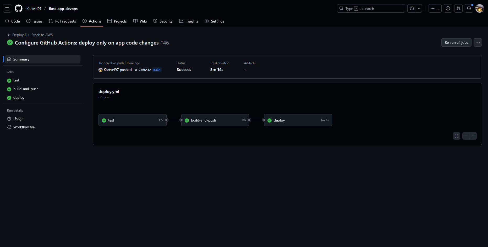
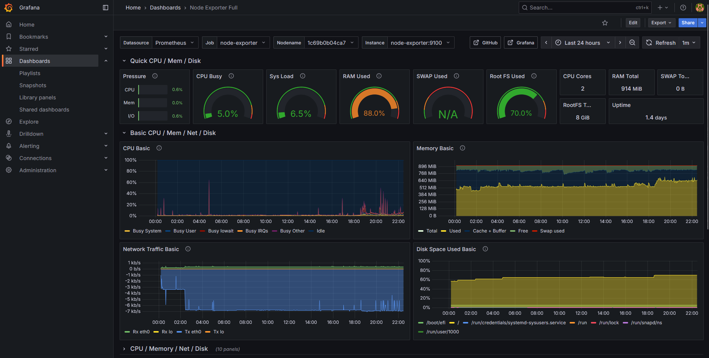
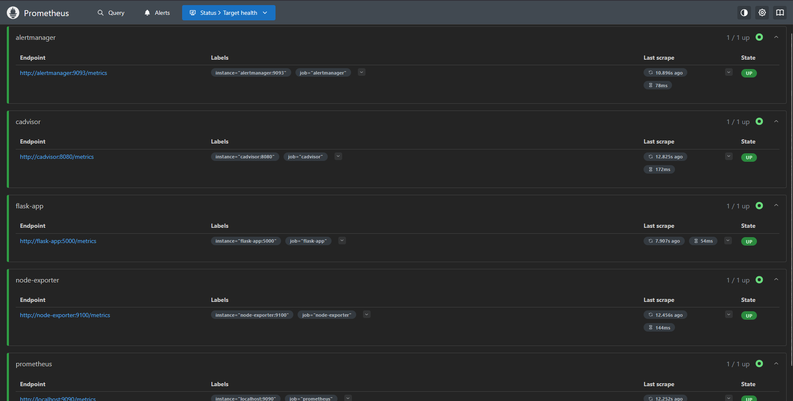

# Flask DevOps Project

[](https://www.python.org/)
[](https://flask.palletsprojects.com/)
[](https://www.docker.com/)
[](https://www.terraform.io/)
[](https://www.ansible.com/)
[](https://github.com/features/actions)

A learning project: a Flask web app with infrastructure provisioning (Terraform), server automation (Ansible), CI/CD (GitHub Actions), and monitoring (Prometheus, Grafana, Loki). I built this to understand how these tools work together end-to-end.

Previously deployed on AWS EC2. Screenshots in `/screenshots/` show the running state.

---

## Architecture

```
┌─────────────────────────────────────────────────────────────┐
│                    Cloudflare (CDN/DNS/SSL)                  │
└───────────────────────────┬─────────────────────────────────┘
                            │
┌───────────────────────────▼─────────────────────────────────┐
│              AWS EC2 (t3.micro, Ubuntu 22.04)                │
│  ┌──────────────────────────────────────────────────────┐   │
│  │              Nginx (Reverse Proxy + SSL)              │   │
│  └───────────────────────────┬──────────────────────────┘   │
│                              │                               │
│  ┌───────────────────────────▼──────────────────────────┐   │
│  │         Docker Network (monitoring)                    │   │
│  │  ┌──────────────┐  ┌──────────────┐  ┌────────────┐ │   │
│  │  │ Flask App    │  │ Prometheus   │  │  Grafana   │ │   │
│  │  │ (Gunicorn)   │  │ (Metrics)    │  │ (Dashboards)│ │   │
│  │  └──────────────┘  └──────────────┘  └────────────┘ │   │
│  │  ┌──────────────┐  ┌──────────────┐  ┌────────────┐ │   │
│  │  │    Loki      │  │  Promtail    │  │Node Exporter│ │   │
│  │  │   (Logs)     │  │ (Log Agent)  │  │ (Metrics)  │ │   │
│  │  └──────────────┘  └──────────────┘  └────────────┘ │   │
│  │  ┌──────────────┐  ┌──────────────┐                  │   │
│  │  │Alertmanager  │  │  cAdvisor    │                  │   │
│  │  │  (Alerts)    │  │ (Containers) │                  │   │
│  │  └──────────────┘  └──────────────┘                  │   │
│  └──────────────────────────────────────────────────────┘   │
└─────────────────────────────────────────────────────────────┘
```

### CI/CD Pipeline

```
┌─────────────┐
│ GitHub Push │
└──────┬──────┘
       │
       ▼
┌─────────────────┐
│  GitHub Actions │
│  ┌───────────┐  │
│  │   Test    │  │ ← pytest
│  └─────┬─────┘  │
│        │        │
│  ┌─────▼─────┐  │
│  │   Build   │  │ ← Docker
│  └─────┬─────┘  │
│        │        │
│  ┌─────▼─────┐  │
│  │   Push    │  │ ← GHCR
│  └─────┬─────┘  │
│        │        │
│  ┌─────▼─────┐  │
│  │  Deploy   │  │ ← SSH → AWS
│  └───────────┘  │
└─────────────────┘
```

---

## Tech Stack

| Layer | Technology | Purpose |
|-------|------------|---------|
| **CDN/DNS** | Cloudflare | CDN, DDoS protection, SSL |
| **Cloud** | AWS EC2 | Compute instance (t3.micro) |
| **OS** | Ubuntu 22.04 LTS | Server environment |
| **Web Server** | Nginx | Reverse proxy + SSL termination |
| **Container** | Docker | Application isolation |
| **App Server** | Gunicorn | WSGI HTTP server |
| **Framework** | Flask | Web framework |
| **Language** | Python 3.11+ | Backend language |
| **IaC** | Terraform | Infrastructure provisioning |
| **Config Mgmt** | Ansible | Server automation |
| **CI/CD** | GitHub Actions | Automated deployment |
| **Monitoring** | Prometheus | Metrics collection |
| **Visualization** | Grafana | Dashboards |
| **Logging** | Loki + Promtail | Centralized logging |
| **Alerts** | Alertmanager | Alert management |
| **Backup** | Scripts + S3 | Automated backups |

---

## Project Structure

```
flask-app-devops/
├── .github/workflows/
│   └── deploy.yml          # CI/CD pipeline
├── ansible/                # Configuration Management
│   ├── deploy-flask-app.yml
│   ├── setup-monitoring.yml
│   ├── setup-nginx-ssl.yml
│   ├── setup-backup.yml
│   └── inventory.ini.example
├── backup/
│   └── scripts/
│       ├── backup.sh
│       ├── restore.sh
│       └── verify_backup.sh
├── docker/
│   ├── Dockerfile
│   └── requirements.txt
├── monitoring/
│   ├── docker-compose.monitoring.yml
│   ├── prometheus/
│   │   ├── prometheus.yml
│   │   ├── alerts.yml
│   │   └── alertmanager.yml
│   ├── grafana/
│   │   ├── dashboards/
│   │   │   └── flask-app-dashboard.json
│   │   ├── import-dashboards.sh
│   │   ├── setup-alerts.sh
│   │   └── provisioning/
│   ├── loki/
│   │   └── loki-config.yml
│   └── promtail/
│       └── promtail-config.yml
├── src/
│   └── app.py
├── tests/
│   ├── test_app.py
│   └── requirements.txt
├── terraform/
│   └── main.tf
├── screenshots/
│   ├── github-actions-workflow.png
│   ├── grafana-dashboard.png
│   └── prometheus-targets.png
├── README.md
└── SETUP_REQUIREMENTS.md
```

---

## Quick Start

**Prerequisites:** AWS account, SSH key pair, domain (optional), GitHub repo with Actions enabled.

1. **Deploy infrastructure:** `cd terraform && terraform init && terraform apply -var="ssh_key_name=your_key_name"`
2. **Configure Ansible:** `cp ansible/inventory.ini.example ansible/inventory.ini` and edit with your IP/SSH path
3. **Deploy app:** `ansible-playbook -i inventory.ini deploy-flask-app.yml`
4. **Setup Nginx + SSL:** `ansible-playbook -i inventory.ini setup-nginx-ssl.yml -e "domain_name=your-domain.com" -e "email=your@email.com"`
5. **Setup monitoring:** `ansible-playbook -i inventory.ini setup-monitoring.yml`
6. **Setup backups:** `ansible-playbook -i inventory.ini setup-backup.yml`

See [SETUP_REQUIREMENTS.md](SETUP_REQUIREMENTS.md) for full details.

---

## CI/CD Pipeline

Runs on push to `main` (code changes only).

1. **Test** — pytest with coverage
2. **Build** — Docker image
3. **Push** — GitHub Container Registry
4. **Deploy** — SSH to AWS

---

## Monitoring

- **Prometheus** (`:9090`) — metrics from Flask, Node Exporter, cAdvisor, Loki, Promtail
- **Grafana** (`:3000`) — dashboards with HTTP stats, latency, errors, CPU/memory
- **Loki** (`:3100`) — logs from Flask and containers
- **Alertmanager** (`:9093`) — alerts for app down, disk space, high CPU, error rate

---

## Backup & Recovery

Daily at 02:00 UTC (systemd timer). Backs up: Docker volumes, app code, configs. Local retention: 7 days; S3: 30 days (if configured)

Manual: `sudo /usr/local/bin/backup.sh`  
Restore: `sudo /usr/local/bin/restore.sh /opt/backups/backup_YYYYMMDD_HHMMSS.tar.gz`

---

## Security

- **Rate limiting** — Nginx (10 req/s API, 30 req/s general)
- **SSL/TLS** — Let's Encrypt with auto-renewal
- **Security headers** — X-Frame-Options, HSTS, XSS Protection
- **Non-root** — Docker containers run as non-root

---

## Testing

```bash
pytest tests/ -v --cov=src --cov-report=term-missing
```

Tests run automatically on push via GitHub Actions.

---

## Screenshots

### GitHub Actions CI/CD Workflow


### Grafana Dashboard


### Prometheus Targets


---

## License

Licensed under the [MIT License](LICENSE).

---

## Author

**Kartvel97**

- GitHub: [@Kartvel97](https://github.com/Kartvel97)
- LinkedIn: [linkedin.com/in/kartvel97](https://www.linkedin.com/in/kartvel97)
- Email: barem068@gmail.com
